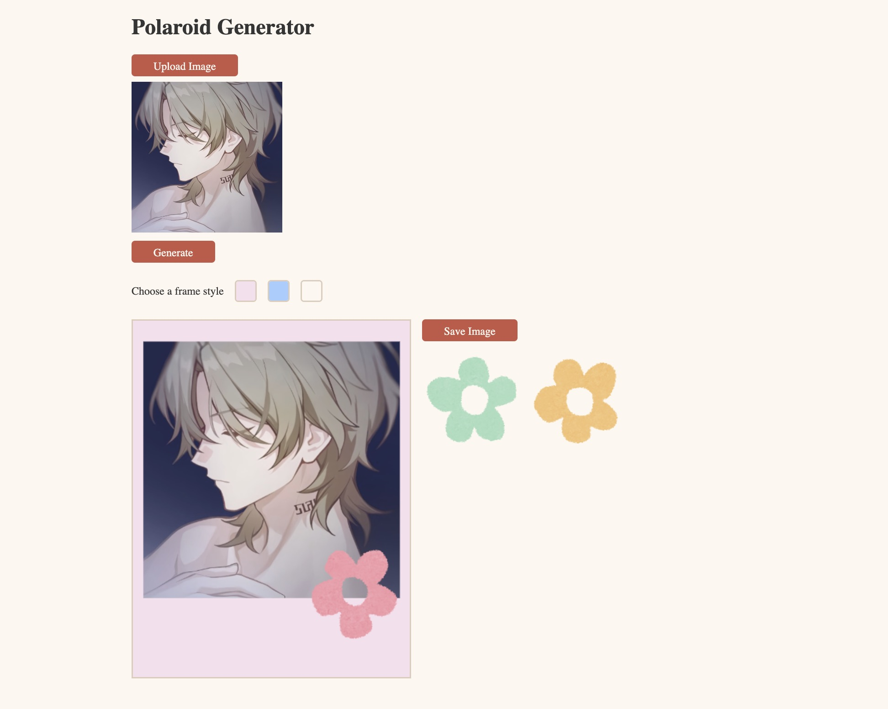

# Polaroid Generator

A simple polaroid generator that allows users to upload an image of any ratio and transform it into a Polaroid-style photo. Users can also decorate their Polaroid with flower stickers.
  

## Features

- **Upload Images**: Users can upload images with any aspect ratio to create a Polaroid photo.
- **Generate Polaroid**: Convert your uploaded image into a Polaroid instantly.
- **Frame Styles**: Choose from different Polaroid frame styles to suit your image.
- **Add Decorations**: Enhance your Polaroid photo with draggable flower stickers.
- **Save Your Creation**: Download your final Polaroid image to your device.

## Technologies Used

- **HTML**
- **CSS**
- **JavaScript**

## Continued development

- make drag and drop function work on android devices
